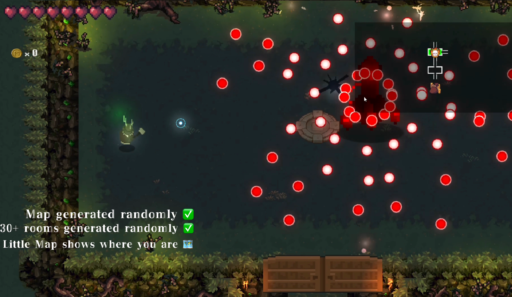

# 🌟 Qliphoth

Welcome to our **Roguelike Game**, developed during the **Singapore Summer School** by a team of four passionate students:

- Haoyang Qin
- Weidong Zhao  
- Shimeng Jia
- Yunhao Li   

## 🎮 Game Overview

This is a fast-paced roguelike adventure game where players control a character to explore procedurally generated levels, collect various items, and grow stronger by combining different abilities.

Every trip is a unique experience, full of strategy, growth, and intense battles.

### 🔗 Play Online

Experience the game directly in your browser:  
👉 [Play Now](https://play.unity.com/en/games/72fe58bf-f597-45cc-b0da-59d9796d7b3d/finalwebgl)

---

## 🖼️ Game Poster
<!--  -->
  

---

## 📸 In-Game Screenshots

### Screenshot 1  
<!--  -->
  

### Screenshot 2  
<!--  -->
  

### Screenshot 3  
<!--  -->
  

---

Thank you for checking out our project! We hope you enjoy playing it as much as we enjoyed making it.
